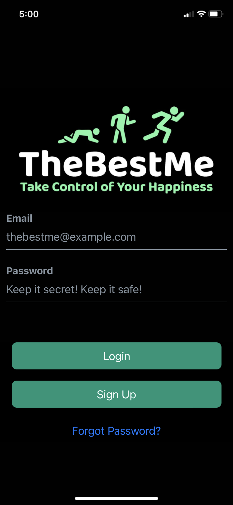
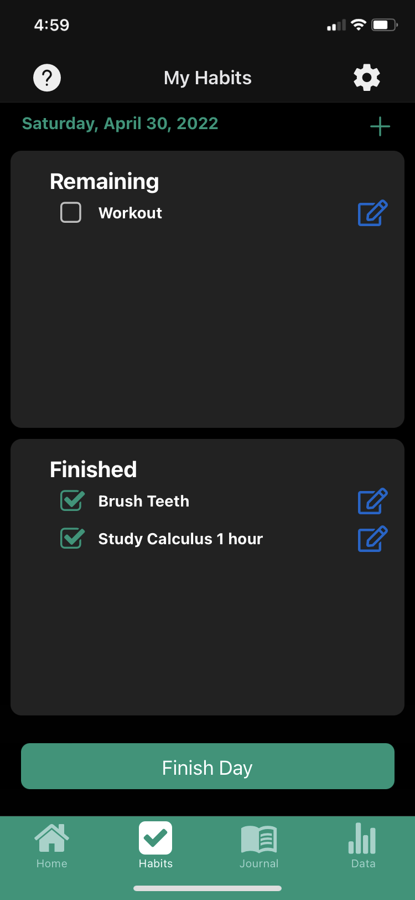
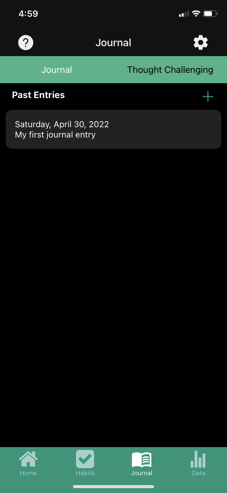
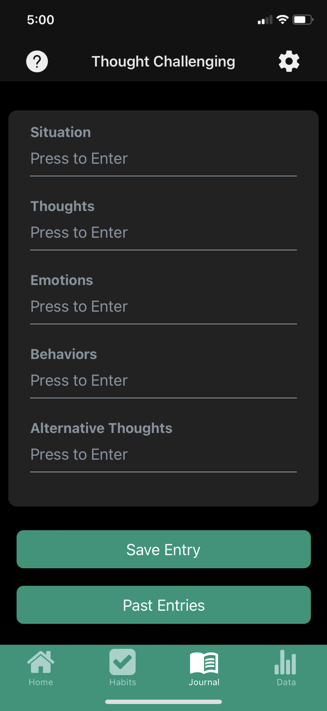
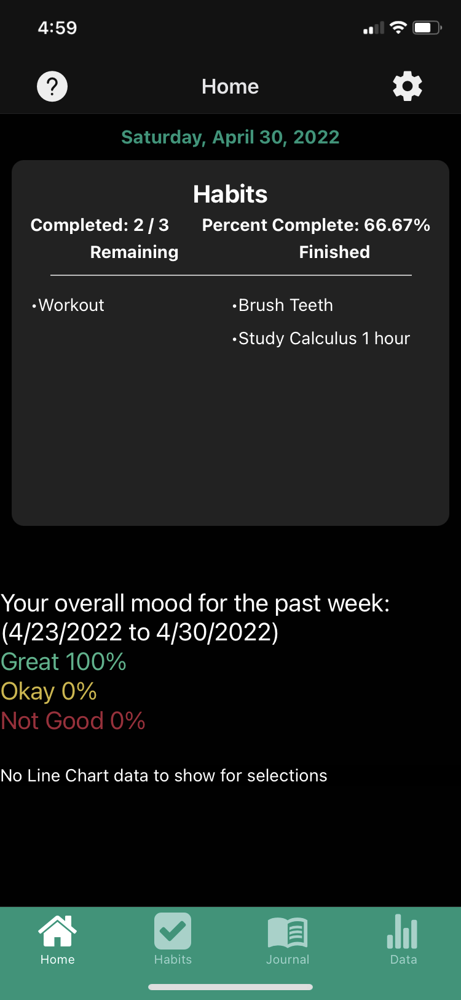

# TheBestMe

An app designed to help anyone take control of their mental health by utilizing thought-challenging journaling techniques, habit tracking, and mood tracking.

TheBestMe provides a variety of insights by correlating a person's mood with their habits, thereby revealing what habits may be causing them to feel a particular way.

The app is currently still in beta-testing, but feel free to check out our [website](https://www.thebestmeofficial.com/) for updates!

## Screenshots

---

---

---

---

